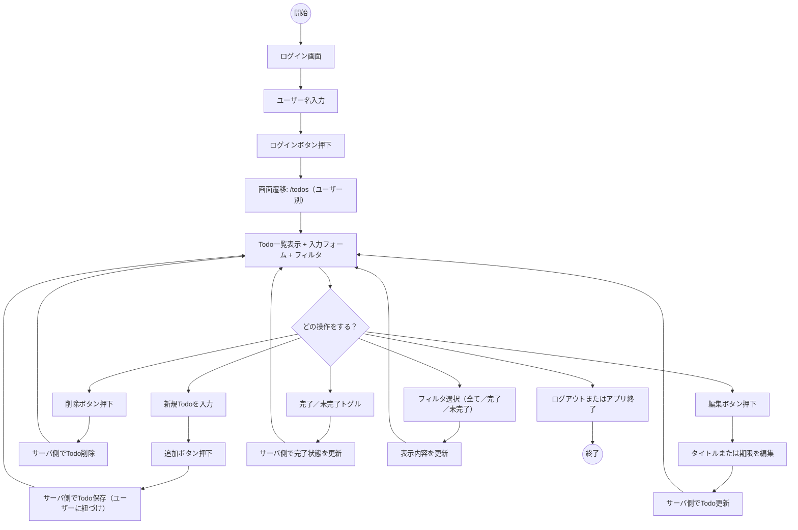

```mermaid
graph TD
    Start((開始)) --> A[ログイン画面]
    A --> B[ユーザー名入力]
    B --> C[ログインボタン押下]
    C --> D[画面遷移: /todos（ユーザー別）]
    D --> E[Todo一覧表示 + 入力フォーム + フィルタ]
    E --> Z{どの操作をする？}

    Z --> F[新規Todoを入力]
    F --> G[追加ボタン押下]
    G --> H[サーバ側でTodo保存（ユーザーに紐づけ）]
    H --> E

    Z --> I[削除ボタン押下]
    I --> J[サーバ側でTodo削除]
    J --> E

    Z --> K[編集ボタン押下]
    K --> L[タイトルまたは期限を編集]
    L --> M[サーバ側でTodo更新]
    M --> E

    Z --> N[完了／未完了トグル]
    N --> O[サーバ側で完了状態を更新]
    O --> E

    Z --> P[フィルタ選択（全て／完了／未完了）]
    P --> Q[表示内容を更新]
    Q --> E

    Z --> R[ログアウトまたはアプリ終了]
    R --> End((終了))

```
