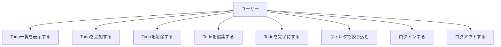

# ユースケース図
システムに何が求められているか（＝ユーザーが何をしたいか）を明確にするのが目的。

システムから見た利用者がアクター、システムができる機能がユースケース

ここでは、ただ機能の粒度を確認しているだけ

```mermaid
graph TD
  User[ユーザー] --> A[Todo一覧を表示する]
  User --> B[Todoを追加する]
  User --> C[Todoを削除する]
  User --> D[Todoを編集する]
  User --> E[Todoを完了にする]
  User --> F[フィルタで絞り込む]
  User --> G[ログインする]
  User --> H[ログアウトする]

```
