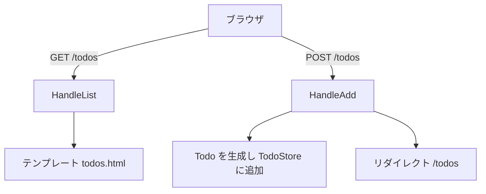

## ルーティング図（エンドポイントと処理の対応）

```mermaid
graph TD
    A[ブラウザ] -->|GET /todos| B[HandleList]
    A -->|POST /todos| C[HandleAdd]
    B --> D[テンプレート todos.html]
    C --> E[Todo を生成し TodoStore に追加]
    C --> F[リダイレクト /todos]
```