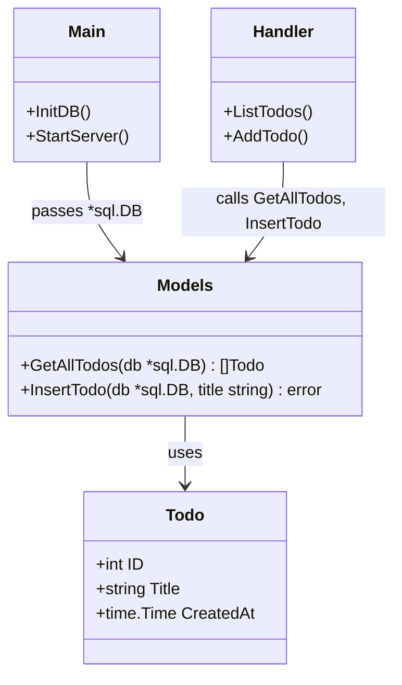

# クラス図
プログラムの設計図（メソッドも含む）

関数型

```mermaid
classDiagram
    class Todo {
        +int ID
        +string Title
        +time.Time CreatedAt
    }

    class Models {
        +GetAllTodos(db *sql.DB) []Todo
        +InsertTodo(db *sql.DB, title string) error
    }

    class Handler {
        +ListTodos()
        +AddTodo()
    }

    class Main {
        +InitDB()
        +StartServer()
    }

    Main --> Models : passes *sql.DB
    Handler --> Models : calls GetAllTodos, InsertTodo
    Models --> Todo : uses
```