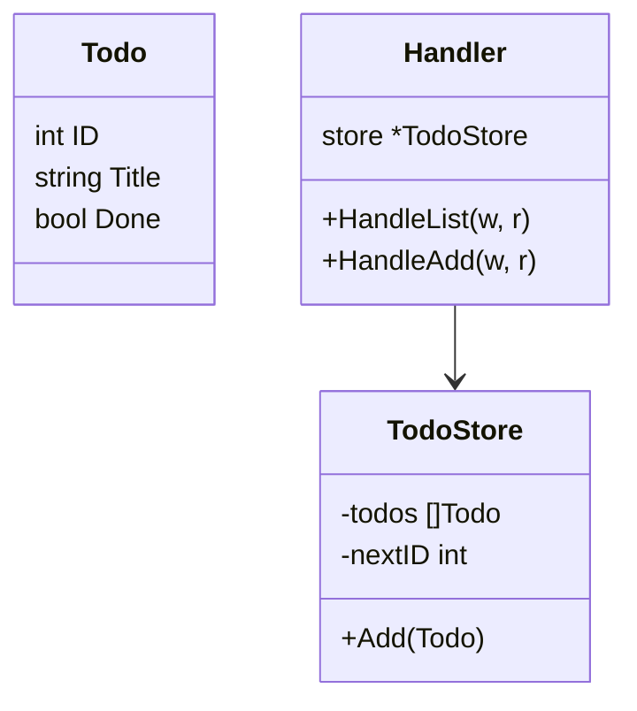

# クラス図
プログラムの設計図（メソッドも含む）

```mermaid
classDiagram
    class Todo {
        int ID
        string Title
        bool Done
    }

    class TodoStore {
        +Add(Todo)
        -todos []Todo
        -nextID int
    }

    class Handler {
        +HandleList(w, r)
        +HandleAdd(w, r)
        store *TodoStore
    }

    Handler --> TodoStore
```