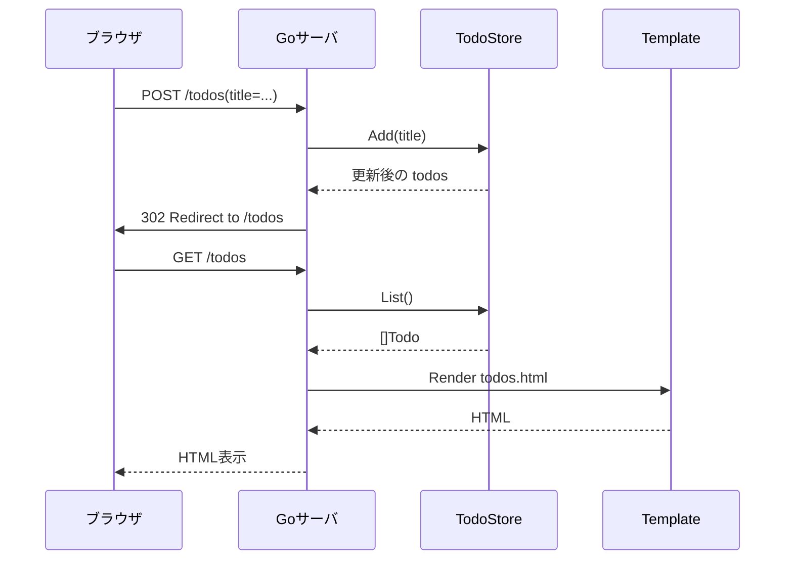

# シーケンス図（リクエスト処理の流れ）

```mermaid
sequenceDiagram
    participant Client as ブラウザ
    participant Server as Goサーバ
    participant Store as TodoStore
    participant View as Template

    Client->>Server: POST /todos(title=...)
    Server->>Store: Add(title)
    Store-->>Server: 更新後の todos
    Server->>Client: 302 Redirect to /todos

    Client->>Server: GET /todos
    Server->>Store: List()
    Store-->>Server: []Todo
    Server->>View: Render todos.html
    View-->>Server: HTML
    Server-->>Client: HTML表示
```